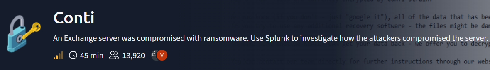
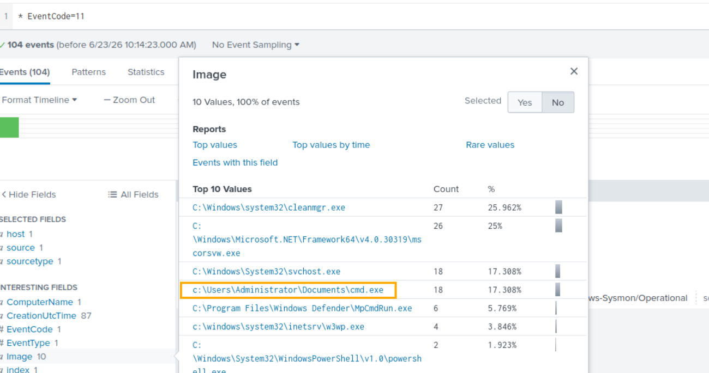
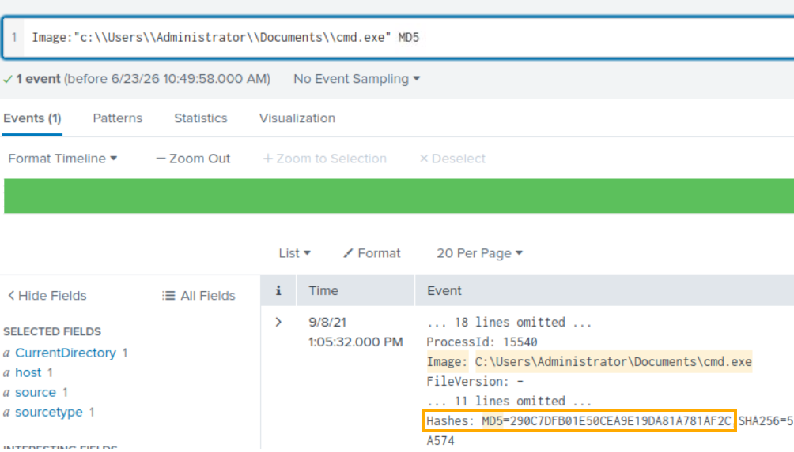
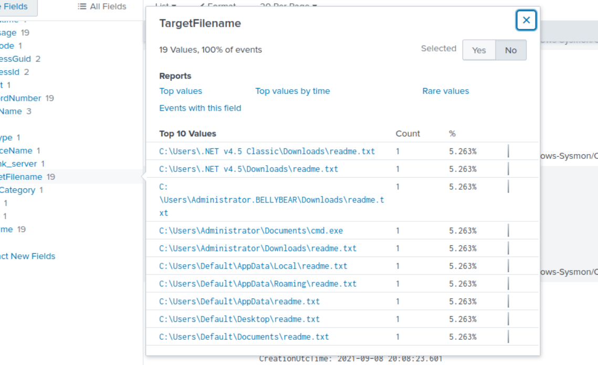
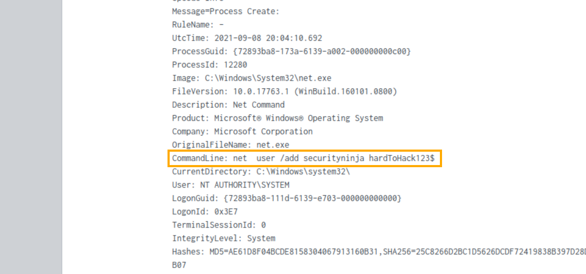
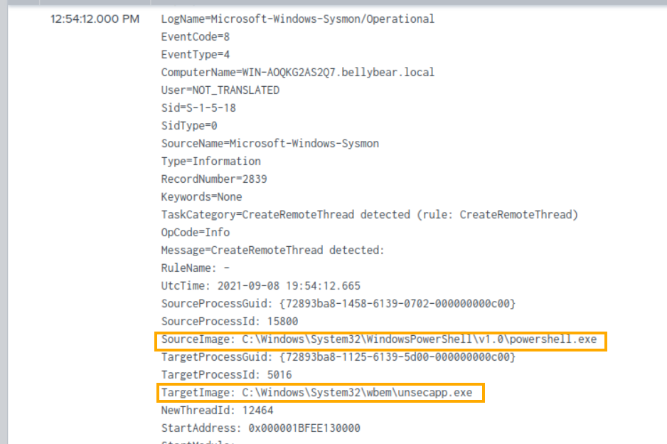
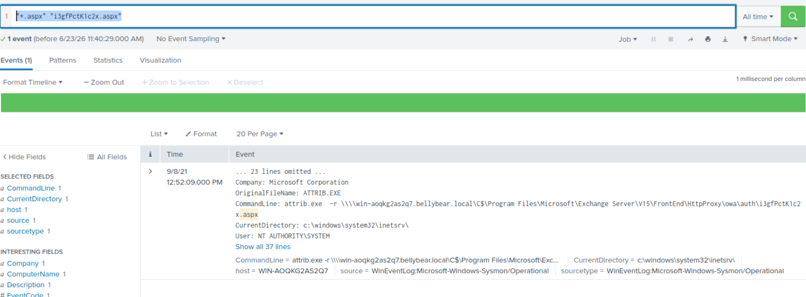

# Conti Ransomware - Compromised Server Write-Up

## Overview


This room simulates a ransomware investigation based on the **Conti** ransomware family.

Conti is a ransomware-as-a-service (RaaS) operation that became one of the most prolific and destructive ransomware groups between 2020 and 2022. It is known for targeting critical infrastructure, healthcare organizations, and enterprise environments, often combining data encryption with data exfiltration as a double extortion tactic.

The objective of this investigation was to analyze the available logs in Splunk, reconstruct the attack chain, identify the tools and techniques used by the attacker, and collect Indicators of Compromise (IOCs).

---

## Investigation Methodology

The investigation was performed using Splunk by reviewing:

- File creation events (Sysmon EventCode 11)
- Process creation events
- Remote thread creation events (Sysmon EventCode 8)
- PowerShell execution logs
- IIS web server logs

Throughout the investigation, Sysmon event IDs were used to correlate attacker activity across different stages of the attack chain.

---

## Investigation Findings

### 1. Ransomware Location

To identify the ransomware binary, I reviewed recently created files on the compromised system by searching for new file creation events.

The ransomware was found at the following location:

```text
C:\Users\Administrator\Documents\cmd.exe
```

Dropping a malicious executable named `cmd.exe` is a masquerading technique (MITRE T1036) designed to blend in with legitimate Windows system processes and avoid detection.



---

### 2. Sysmon Event ID for File Creation

Sysmon Event ID **11** corresponds to file creation events. This event type is critical in ransomware investigations as it allows analysts to track when and where malicious files are written to disk.

```text
Sysmon EventCode: 11
```

---

### 3. MD5 Hash of the Ransomware

To obtain the hash of the ransomware binary, I searched for Sysmon events associated with the identified file path:

```splunk
Image="C:\Users\Administrator\Documents\cmd.exe" MD5
```

> Note: In Splunk, the backslash `\` is treated as an escape character. Double backslashes `\\` must be used to search for literal backslash characters in file paths.

The MD5 hash of the ransomware binary was identified as:

```text
MD5: 290C7DFB01E50CEA9E19DA81A781AF2C
```

This hash can be submitted to threat intelligence platforms such as VirusTotal to confirm the malware family and retrieve additional context.



---

### 4. File Saved to Multiple Locations

To identify files dropped by the ransomware across the system, I searched for file creation events associated with the ransomware binary:

```splunk
Image="C:\Users\Administrator\Documents\cmd.exe" EventCode=11
```

Reviewing the `TargetFileName` field revealed that the following file was saved to multiple folder locations:

```text
Readme.txt
```

The `Readme.txt` file is the ransomware note, dropped in multiple directories to ensure the victim encounters it regardless of which folder they open.



---

### 5. Command Used to Add a New User

To identify persistence mechanisms, I searched for commands related to user account creation:

```splunk
CommandLine="*add*"
```

This revealed the following command executed by the attacker:

```text
net user /add securityninja hardToHack123$
```

Creating a new local user account is a common persistence technique (MITRE T1136.001) that allows the attacker to maintain access to the compromised system even if the original access vector is remediated.

>.

---

### 6. Process Migration

To identify process injection activity, I searched for Sysmon EventCode 8 (CreateRemoteThread), which captures events where one process creates a thread in another process.

```splunk
EventCode=8
```

Filtering by the `TargetImage` field revealed the following migration:
| | Process |
| --- | --- |
| Original Process | C:\Windows\System32\WindowsPowerShell\v1.0\powershell.exe |
| Migrated Process | C:\Windows\System32\wbem\unsecapp.exe |

The attacker migrated from PowerShell into unsecapp.exe, a legitimate Windows WMI process, to achieve better persistence and avoid detection. This technique (MITRE T1055) allows malicious code to run under the context of a trusted system process.



### 7. Credential Dumping via LSASS
While reviewing the EventCode 8 results, a second event was identified targeting the following process:

```text
C:\Windows\System32\lsass.exe
```

`lsass.exe` (Local Security Authority Subsystem Service) is the Windows process responsible for storing user credentials and authentication tokens. Accessing this process is a well-known credential dumping technique (MITRE T1003.001) that allows attackers to extract password hashes and potentially move laterally across the network.


### 8. Web Shell Identification
To identify the web shell deployed during the attack, I searched for `.aspx` files in the IIS logs:

```splunk
"*.aspx" sourcetype=iis NOT "default.aspx"
```
The following web shell was identified:

```text
i3gfPctK1c2x.aspx
```

The web shell was deployed to the Microsoft Exchange Server frontend directory, suggesting the attacker exploited a vulnerability in the Exchange Server to gain initial access to the environment.

### 9. Web Shell Execution Command
To identify how the web shell was executed, I searched for command-line activity associated with the web shell filename:

```splunk
"*.aspx" "i3gfPctK1c2x.aspx"
```

Reviewing the CommandLine field revealed the following command:

```text
attrib.exe -r \\win-aoqkg2as2q7.bellybear.local\C$\Program Files\Microsoft\Exchange Server\V15\FrontEnd\HttpProxy\owa\auth\i3gfPctK1c2x.aspx
```

The attrib.exe -r command removes the read-only attribute from the web shell file. This was likely executed to ensure the file could be modified or overwritten without restrictions, indicating the attacker was actively managing their access to the compromised Exchange Server.



## Indicators of Compromise (IOCs)
| IOC Type | Indicator | Description |
| --- | --- | --- |
| Ransomware Binary| C:\Users\Administrator\Documents\cmd.exe | Masqueraded ransomware executable |
| MD5 Hash | 290C7DFB01E50CEA9E19DA81A781AF2C | Hash of the ransomware binary |
| Ransom Note | Readme.txt | Dropped in multiple directories |
| User Account | securityninja | Backdoor account created by attacker |
| Web Shell | i3gfPctK1c2x.aspx | Deployed to Exchange Server OWA directory |
| Process | lsass.exe | Targeted for credential dumping |

## Conclusion
The investigation confirmed the execution of a Conti ransomware attack against a Windows environment with a publicly exposed Microsoft Exchange Server.

The attacker gained initial access by deploying a web shell (i3gfPctK1c2x.aspx) to the Exchange Server OWA directory, likely exploiting a known vulnerability. From there, the attacker established persistence by creating a backdoor user account (securityninja) and migrating their process from PowerShell into the legitimate Windows process unsecapp.exe to avoid detection.

Credential dumping was performed by accessing lsass.exe, potentially enabling lateral movement across the network. The ransomware binary was deployed masquerading as cmd.exe and dropped ransom notes (Readme.txt) across multiple directories.

The collected evidence maps directly to multiple MITRE ATT&CK techniques and highlights the multi-stage nature of the Conti ransomware operation.