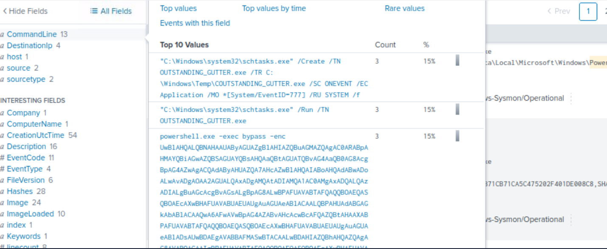
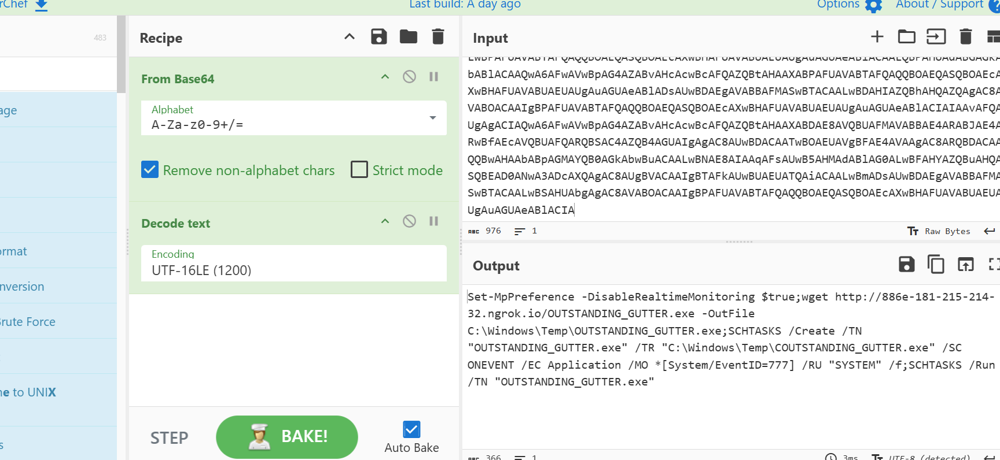
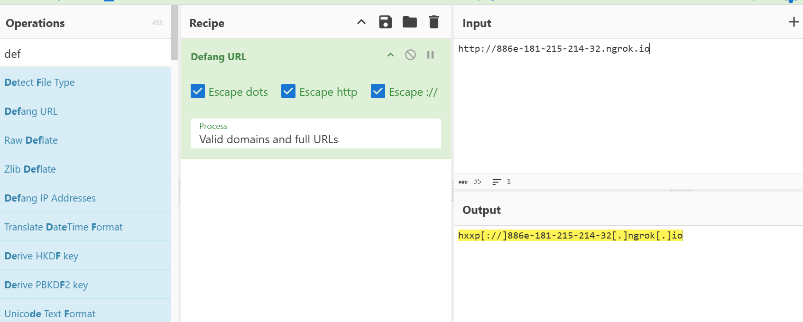
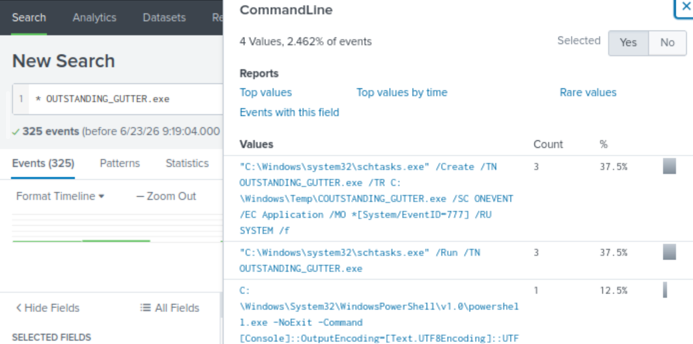
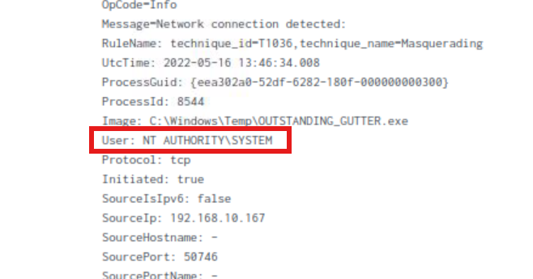
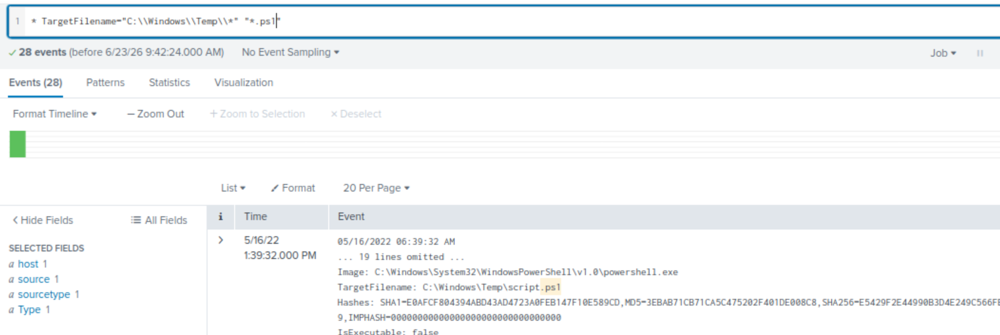
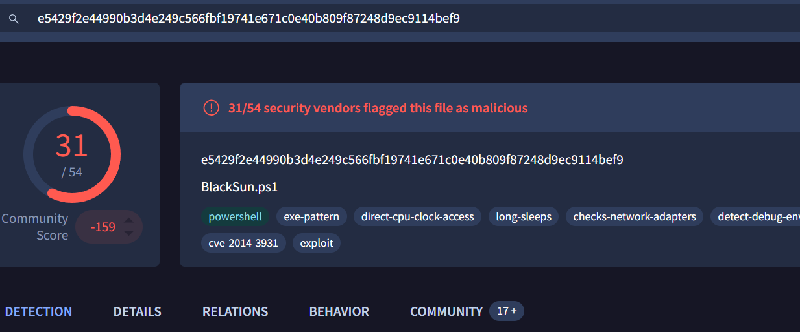
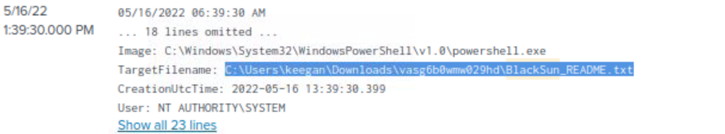

# PS Eclipse - Incident Investigation Write-Up

## Overview


This room simulates a ransomware investigation from the perspective of a SOC Analyst working for the MSSP company *TryNotHackMe*.

The customer reported suspicious activity on Keegan's workstation on May 16th, 2022. Although the endpoint remained operational, several files had been modified and displayed unusual extensions, raising concerns about a potential ransomware attack.

The objective of this investigation was to analyze the available logs in Splunk, identify the attack chain, determine the malware involved, and collect Indicators of Compromise (IOCs).

---

## Investigation Methodology

The investigation was performed using Splunk by reviewing:

- Process creation events
- PowerShell execution logs
- File creation events
- Network connections
- Scheduled task activity

Throughout the investigation, CyberChef was used to decode obfuscated PowerShell commands, while VirusTotal was leveraged to validate file hashes and identify known malicious artifacts.

---


## Investigation Findings

### 1. Identification of the Suspicious Binary

To identify the initial malicious payload, I reviewed events associated with the destination IP address and searched for executable files (`.exe`) involved in suspicious activity.

The investigation revealed the following binary:

```text
OUTSTANDING_GUTTER.exe
```

This executable appears to be the primary payload used during the attack.



---

### 2. Download Source Analysis

Next, I investigated how the binary was delivered to the endpoint.

By reviewing PowerShell execution events and analyzing the `CommandLine` field, I identified an encoded PowerShell command responsible for downloading the payload.

After decoding the command with CyberChef, the source URL was revealed:

```text
hxxp[://]886e-181-215-214-32[.]ngrok[.]io
```

The use of an ngrok tunnel suggests the attacker attempted to hide the true hosting infrastructure behind a temporary public endpoint.





---

### 3. Download Mechanism

The same event confirmed that PowerShell was used to retrieve the malicious binary.

Executable:

```text
C:\Windows\System32\WindowsPowerShell\v1.0\powershell.exe
```

PowerShell is commonly abused by attackers due to its native presence on Windows systems and its ability to execute remote content without requiring additional tools.

---

### 4. Persistence Mechanism

To determine how the malware maintained execution, I searched for events containing the binary name and analyzed the associated command-line activity.

This revealed the creation of a scheduled task:

```text
"C:\Windows\system32\schtasks.exe" /Create /TN OUTSTANDING_GUTTER.exe /TR C:\Windows\Temp\OUTSTANDING_GUTTER.exe /SC ONEVENT /EC Application /MO *[System/EventID=777] /RU SYSTEM /f
```

This command creates a scheduled task configured to run whenever a specific event is generated.

Key observations:

- Persistence was established through Windows Scheduled Tasks.
- The task was configured to execute under the SYSTEM account.
- The malware would automatically execute when the trigger condition was met.



---

### 5. Privilege Level and Execution

Further review of scheduled task activity revealed how the binary was executed.

Permission level:

```text
NT AUTHORITY\SYSTEM
```

Execution command:

```text
"C:\Windows\system32\schtasks.exe" /Run /TN OUTSTANDING_GUTTER.exe
```

Running under the SYSTEM account granted the malware the highest level of privileges available on the host, significantly increasing its ability to modify files and system settings.



---

### 6. Command and Control Communication

After establishing persistence, the malware initiated outbound communication.

Searching for additional references to ngrok domains revealed the following destination:

```text
hxxp[://]9030-181-215-214-32[.]ngrok[.]io
```

This connection likely served as the command-and-control (C2) channel used by the attacker.


---

### 7. Additional Payload Download

The investigation revealed that a PowerShell script was downloaded into the same directory used by the binary.

Location:

```text
C:\Windows\Temp
```

Using file creation events and filtering for PowerShell scripts (`.ps1`), I identified the downloaded file:

```text
script.ps1
```

The presence of an additional script suggests the attack involved multiple stages beyond the initial payload.



---

### 8. Malware Identification

While reviewing file creation events, I identified hashes associated with the downloaded script.

The hash was submitted to VirusTotal, which identified the script as:

```text
BlackSun.ps1
```

This finding provided a direct link between the observed activity and the BlackSun ransomware family.



---

### 9. Ransom Note Discovery

To identify ransomware-related artifacts, I searched for references to "BlackSun" within the collected events.

This revealed the ransom note:

```text
BlackSun_README.txt
```

Full path:

```text
C:\Users\keegan\Downloads\vasg6b0wmw029hd\BlackSun_README.txt
```

The presence of a ransom note is a strong indicator that the ransomware execution stage was completed successfully.



---

### 10. Desktop Wallpaper Modification

The investigation also identified an image used to replace the victim's desktop wallpaper.

File path:

```text
C:\Users\Public\Pictures\blacksun.jpg
```

Changing the victim's wallpaper is a common ransomware technique used to ensure the victim notices the attack immediately.

---


## Indicators of Compromise (IOCs)
| IOC Type | Indicator | Description |
| --- | --- | --- |
| Binario | exOUTSTANDING_GUTTER.exe | Initial malicious executable |
| PowerShell Script | BlackSun.ps1 | Secondary payload |
| Domain | 886e-181-215-214-32.ngrok.io | Payload download source |
| Domain | 9030-181-215-214-32.ngrok.io | C2 communication |
| Ransom Note | BlackSun_README.txt | Ransomware note |
| Wallpaper | blacksun.jpg | Ransomware wallpaper |


